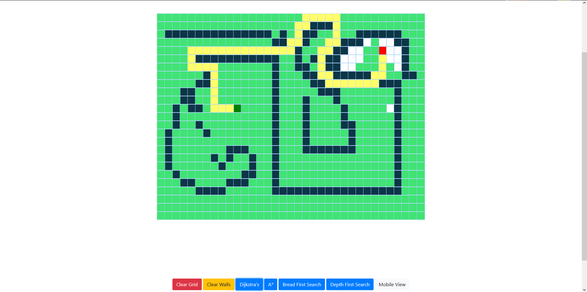
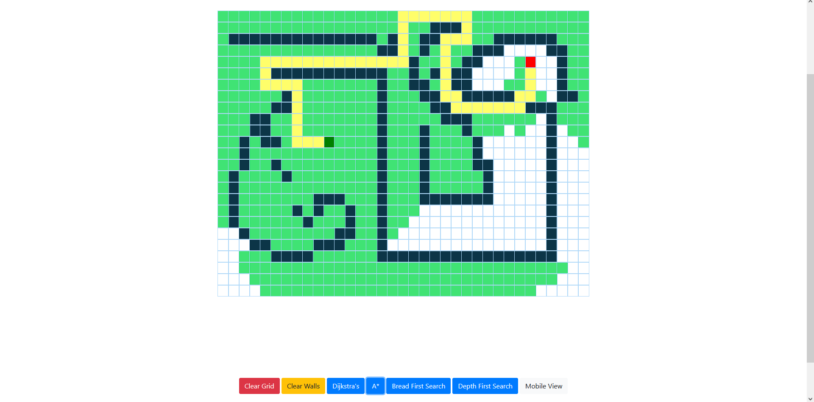
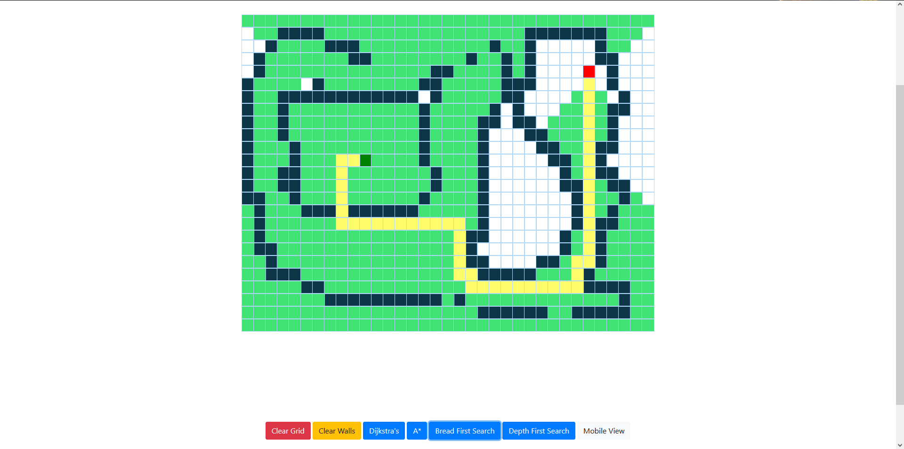
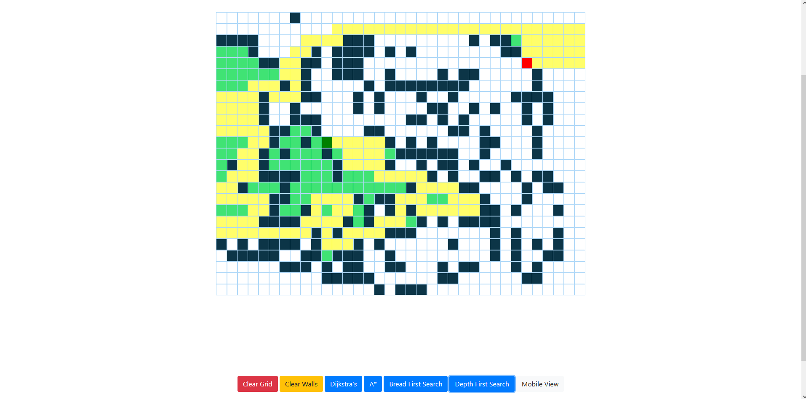

# PATHFINDING VISUALIZER USING REACT APP

This project focus on visualizing some classical algorithms such as BFS,DFS,Dijkstra's algorithm and A\* algorithm.
You can check out live demo

DIJKSTRA'S ALGORITHM

Dijkstra's Algorithm lets us prioritize which paths to explore. Instead of exploring all possible paths equally, it favors lower cost paths.
We can assign lower cost to encourage moving on roads while assigning high cost on highway to avoid them.

  

A\* ALGORITHM

A\* is a modification of Dijkstra’s Algorithm that is optimized for a single destination.
Dijkstra’s Algorithm can find paths to all locations; A\* finds paths to one location. It prioritizes paths that seem to be leading closer to a goal.

  

BFS ALGORITHM

Breadth First Search explores equally in all directions.
This is an incredibly useful algorithm, not only for regular traversal, but also for procedural map generation, flow field pathfinding, distance maps, and other types of map analysis.

  

DFS ALGORITHM

Traverses by exploring as far as possible down each path before backtracking.
As useful as the BFS: DFS can be used to generate a topological ordering, to generate mazes, to traverse trees, to build decision trees, to discover a solution path with hierarchical choices.

  

